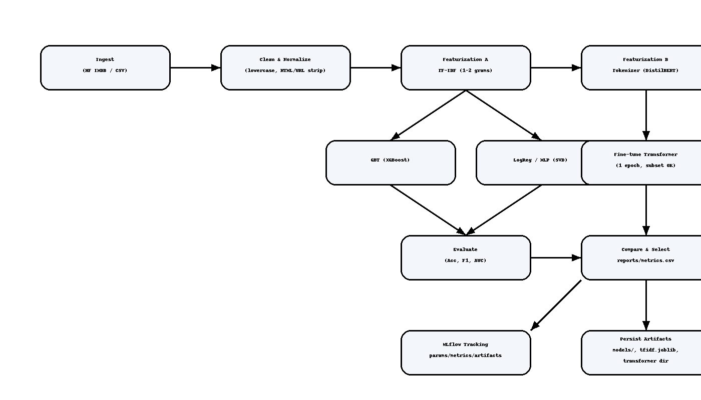

End-to-End NLP Pipeline — IMDB Sentiment (Daxwell Demo)

📘 Overview

This project demonstrates a complete end-to-end NLP machine learning pipeline for sentiment analysis using the IMDB movie review dataset.
It includes both classic ML models (TF-IDF → GBT / LogReg / MLP) and a Transformer-based model (DistilBERT fine-tuning).
All components are modular, reproducible, and designed with MLflow tracking for experiment management.

  

⚙️ Features

Data ingestion from Hugging Face IMDB or CSV

Text preprocessing: HTML cleaning, lowercasing, normalization

Feature engineering: TF-IDF vectorization + DistilBERT tokenization

Model training: XGBoost, Logistic Regression, MLP(SVD), and Transformer

Evaluation: Accuracy, F1-score, and AUC

Experiment tracking via MLflow

Artifact persistence for reproducibility

📂 Repository Structure
.
├── IMDB.ipynb                 # Colab/Notebook walkthrough
├── full_pipeline.py           # Modular CLI script (complete pipeline)
├── pipeline_overview.png      # Architecture diagram (used in README)
├── reports/
│   └── metrics.csv            # Model comparison report
├── models/                    # Trained model binaries (.pkl)
├── vectorizers/               # TF-IDF, SVD, Scaler
├── transformer/model/         # Fine-tuned DistilBERT model
└── requirements.txt

🚀 Quick Start
1️⃣ Install dependencies
pip install -r requirements.txt

2️⃣ Run the classic models
python full_pipeline.py --source imdb --run-gbt --run-logreg

3️⃣ Add MLP via SVD
python full_pipeline.py --source imdb --run-mlp-svd --svd-components 256

4️⃣ Run Transformer
python full_pipeline.py --source imdb --run-transformer --transformer-samples 4000 --transformer-epochs 1

5️⃣Enable MLflow logging
python full_pipeline.py --source imdb --run-gbt --run-logreg --run-transformer --use-mlflow

📊 Outputs

reports/metrics.csv — consolidated performance report

models/ — serialized classic models

vectorizers/ — TF-IDF, SVD, Scaler

transformer/model/ — fine-tuned DistilBERT

mlruns/ — MLflow experiment logs

🧠 Key Learnings

Hybrid NLP workflow: traditional + transformer approaches

Efficient model tracking & reproducibility with MLflow

Modular, scalable design suitable for production deployment
